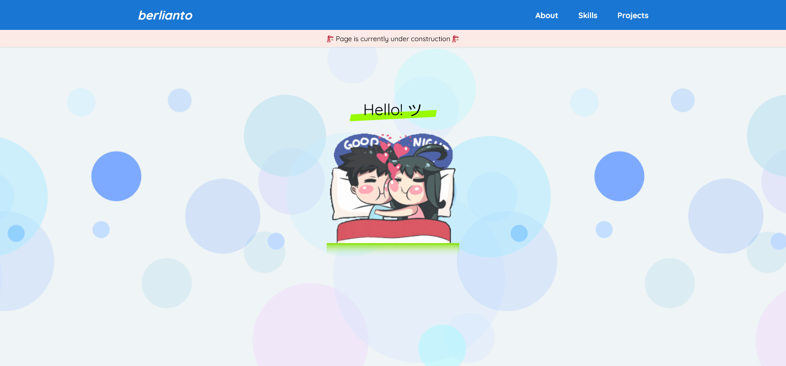

# beginner-portfolio

> ℹ️ **Note**<br>
> _So I have not been code for 7 month and guess what.., when I want to make an application with **Reactjs** I don't even know how to import a things. LOL_

## 📍Table of Contents
- [About the Project](#-about-the-project)
  - [Live](#live-berlianto)
  - [Built With](#-built-with)
- [Getting Started](#-getting-started)
  - [Prerequisites](#prerequisites)
  - [File Structure Overview](#file-structure-overview)
  - [📦 Installation](#-installation)
- [Acknowledgments](#-acknowledgments)

## 🌍 About the Project
Trying to create the web portfolio again and store the latest ***small project*** as a coding exercise specially for the frontend side. Currently I'm trying to have a grasp of web dev/flow and next I will study more for getting better.

**List of Beginner Project:**

- [🚩 `[6]` **previous-portfolio**](https://github.com/xvferdy/my-portfolio "6") 
- [🚩 `[5]` **jojo-tarot**](https://github.com/xvferdy/tarot-of-marseilles-sass "5") 
- [🚩 `[4]` **shopping-cart-app**](https://github.com/xvferdy/shopping-cart-my-ver "4") 
- [🚩 `[3]` **simple-chat-app**](https://github.com/xvferdy/simple-chat-app "3") 
- [🚩 `[2]` **simple-note**](https://github.com/xvferdy/simple-note "2") 
- [🚩 `[1]` **how-to-be-a-millionaire**](https://github.com/xvferdy/how-to-be-a-millionaire "1")
- [🚩 `[0]` **simple-static-website**](https://github.com/xvferdy/simple-static-website "0") 

**Preview** 🕶️
<p align="">
  
</p>

### Live [berlianto](https://berlianto.netlify.app/)
### 👀 Built With
- React
- Sass
- Material-UI
- 💙

## 📥 Getting Started
### Prerequisites
| [](https://nodejs.org/en/download/)</br>Node | [](https://www.npmjs.com/)</br>Npm | [](https://git-scm.com/downloads)</br>Git | [](https://sass-lang.com/dart-sass)</br>Dart Sass
| --------- | --------- | --------- | --------- |
| ~v12.x | ~v8.x | installed | ~v1.43.x compiled with dart2js v2.14.4 |
### File Structure Overview
```
beginner-portfolio
├── node_modules
├── public
├── src
│   ├── assets
│   ├── components
│   ├── layouts
│   ├── pages
│   ├── stylesheets
│   │   ├── css
│   │   └── scss
│   │       ├── base
│   │       ├── components
│   │       ├── helpers
│   │       ├── pages
│   │       └── style.css 
│   ├── utils
│   ├── App.js
│   └── index.js
├── .env
├── .env.sample
├── .gitignore
├── netlify.toml
├── package-lock.json
├── package.json
└── README.md
```

### 📦 Installation
```
npm install
```
```
npm start
```

## 👏 Acknowledgments
- [Netlify](https://www.netlify.com/)
- [PNG images](https://www.pngfind.com/)
- [Random GIF](https://developers.giphy.com/)
- [Social icon tooltip](https://codepen.io/jonmilner/pen/bfkKF)
- [Primer CSS](https://primer.style/)
- [E-signature](https://signaturely.com/online-signature/)
- [Google font](https://fonts.google.com/)

<h3 align="right">
      <a href="#beginner-portfolio">To Top ⤴️</a>
</h3>
